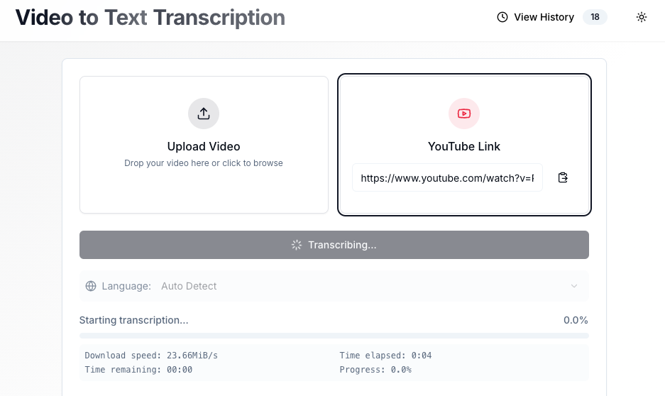

# Video to Text Transcription Web App
## Build with Next.js and vid2cleanTxt



**vid2cleantxt-Web** is a sophisticated web-based platform designed to convert speech from video files into clean, readable text. Leveraging the power of [Hugging Face Transformers](https://huggingface.co/facebook/wav2vec2-large-960h-lv60-self) and [OpenAI's Whisper](https://openai.com/blog/whisper/) model, it provides an intuitive interface for seamless transcription.

## Table of Contents

- [Features](#features)
- [Demo](#demo)
- [Installation](#installation)
- [Usage](#usage)
- [Technologies Used](#technologies-used)
- [Architecture Overview](#architecture-overview)
- [Component Descriptions](#component-descriptions)
- [Advanced Usage](#advanced-usage)
- [FAQ](#faq)
- [Roadmap](#roadmap)
- [Troubleshooting](#troubleshooting)
- [Contributing](#contributing)
- [License](#license)

## Features

- **User-Friendly Interface**: Easily upload and manage your video files.
- **Real-Time Transcription**: Convert audio from videos to text using advanced Automatic Speech Recognition (ASR) models.
- **Keyword Extraction**: Automatically identify key terms and phrases from transcriptions.
- **Search & Summarize**: Efficiently search through transcriptions and generate concise summaries.
- **Download Options**: Export transcriptions and keywords in multiple formats.
- **Dark Mode**: Toggle between light and dark themes for a comfortable viewing experience.
- **History Management**: View, restore, or delete past transcriptions with ease.

## Demo


Experience a live demonstration of **vid2cleantxt-Web** [here](https://vid2cleantxt-web-demo.com).

## Installation

### Prerequisites

- **Node.js** (v14 or later)
- **Python 3.8+**
- **FFmpeg** installed and added to PATH

### Clone the Repository

```bash
git clone https://github.com/pszemraj/vid2cleantxt.git
cd vid2cleantxt
```

### Install Dependencies

```bash
npm install
pip install -r requirements.txt
```

### Configure Environment Variables

Create a `.env` file in the root directory and add the necessary configurations:

```env
NEXT_PUBLIC_API_URL=http://localhost:3000/api
WHISPER_MODEL=whisper-large-v3
```

### Run the Application

```bash
npm run dev
```

Access the web interface at `http://localhost:3000`.

## Usage

1. **Upload Video**: Use the web interface to upload your video files or provide a YouTube link.
2. **Select Language**: Choose the source language for transcription or let the system auto-detect it.
3. **Start Transcription**: Click the "Start Transcription" button to begin the process.
4. **View Results**: Once completed, view the transcriptions and extracted keywords.
5. **Download**: Export the results in your preferred format (e.g., TXT, SRT, JSON).

## Technologies Used

- **Frontend**: Next.js, React, TypeScript, Tailwind CSS, Radix UI, Framer Motion
- **Backend**: Next.js API Routes, Python
- **ASR Models**: Hugging Face Transformers, OpenAI Whisper
- **Others**: FFmpeg, pandas, numpy

## Architecture Overview

### Frontend

Built with **Next.js** and **React**, the frontend provides a dynamic and responsive user interface. It utilizes **Radix UI** for accessible components and **Tailwind CSS** for styling. State management is handled using React hooks and context.

### Backend

The backend leverages **Next.js API Routes** to handle transcription requests. It integrates Python scripts (`transcribe_script.py` and `youtube_download.py`) for video processing and transcription. **Server-Sent Events (SSE)** enable real-time communication between the server and client, providing live progress updates.

### Data Flow

1. **Video Upload**: Users upload video files or provide YouTube links via the frontend.
2. **Processing Request**: The frontend sends a POST request to the `/api/transcribe` endpoint with the video data.
3. **Transcription Workflow**:
   - Uploaded files are validated and processed.
   - YouTube links are downloaded and then processed.
4. **Real-Time Updates**: Transcription progress and logs are streamed back to the frontend using SSE.
5. **Completion**: Final transcription results are sent to the frontend for display and download.

## Component Descriptions

- **`src/components/ui/tabs.tsx`**: Implements tabbed navigation using Radix UI's Tabs component.
- **`src/components/template/video-transcription.tsx`**: Manages video transcription functionalities, including file uploads and progress tracking.
- **`src/app/api/transcribe/route.ts`**: Handles transcription API logic, interfacing with Python scripts and managing SSE connections.
- **`src/components/TranscriptionResults.tsx`**: Displays transcription results with options to edit and view in detail.
- **`src/components/TranscriptionHistory.tsx`**: Manages and displays transcription history, allowing users to restore or delete entries.

## Advanced Usage

### Handling Large Files

The application is optimized to handle video files up to 500MB. Ensure your environment has sufficient memory and processing capabilities to manage large transcriptions efficiently.

### Customizing Transcription Parameters

Adjust transcription settings such as language selection and chunk size by modifying the `.env` file or through the application's settings panel.

## FAQ

**Q1: What video formats are supported?**  
*A1: Currently, vid2cleantxt-Web supports MP4, MOV, WEBM, OGG, and QuickTime formats. Additional formats are planned for future releases.*

**Q2: How long does transcription take?**  
*A2: Transcription time varies based on video length and system performance. Typically, a 5-minute video takes approximately 2-3 minutes to transcribe.*

**Q3: Can I transcribe multiple videos at once?**  
*A3: Currently, the application processes one transcription at a time. Multi-transcription support is on the roadmap for upcoming versions.*

## Roadmap

- **v1.1**:
  - Support for additional video formats (MKV, WMV)
  - Multi-language transcription capabilities
  - Enhanced UI customization options

- **v1.2**:
  - Batch uploads and transcriptions
  - Integration with cloud storage services for saving transcriptions
  - Performance optimizations for faster transcriptions

- **v2.0**:
  - Mobile-friendly interface
  - Real-time collaboration features
  - Advanced analytics and reporting tools for transcription data

## Troubleshooting

**Issue:** _Transcription fails with a "Payload Too Large" error._  
**Solution:** Ensure your video file size does not exceed 500MB. Consider compressing the video or splitting it into smaller segments before uploading.

**Issue:** _FFmpeg installation issues._  
**Solution:** Verify that FFmpeg is correctly installed and added to your system's PATH. Follow the [official installation guide](https://ffmpeg.org/download.html) for assistance.

**Issue:** _Python environment errors._  
**Solution:** Confirm that all required Python packages are installed by running `pip install -r requirements.txt`. Ensure you're using Python version 3.8 or higher.

## Contributing

Contributions are welcome! Please follow these steps:

1. Fork the repository.
2. Create a new branch (`git checkout -b feature/YourFeature`).
3. Commit your changes (`git commit -m 'Add YourFeature'`).
4. Push to the branch (`git push origin feature/YourFeature`).
5. Open a pull request.

Please read the [Contributing Guidelines](CONTRIBUTING.md) for more details.

## License

This project is licensed under the [MIT License](LICENSE).
